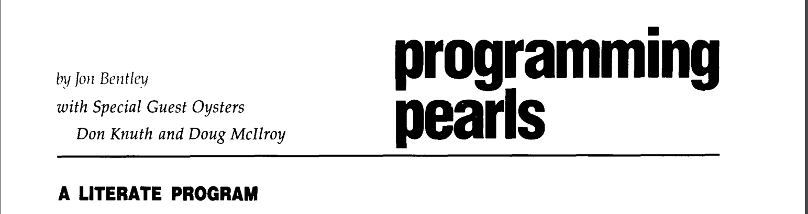

# Rappel
### Compose Algorithms, not Iterators
#### Google's Alternative to Ranges

Authors: Chris Philip and John Bandela  
Presented by: John Bandela at CppNow 2024

---
## History


1986
---
### Challenge
> Given a text file and an integer k, print the k most
common words in the file (and the number of
their occurrences) in decreasing frequency.
--

### Don Knuth

Produces an absolute virtuoso work of art using literate programming and WEB.
* Elegant Pascal code
* Tries
* Beautifully typeset with cross-references

--

### Doug McIlroy 

```
tr -cs A-Za-z`
` |
tr A-Z a-z |
sort |
uniq -c |
sort -rn |
sed ${1} q 

```
--
## Stages
--
### ReadLines
```c++
auto ReadLines() {
  return rpl::TransformComplete([](std::istream &is) {
    return rpl::Generator<absl::string_view>(
        [&is, line = std::string()](auto output) mutable {
          if (std::getline(is, line)) {
            std::move(output)(line);
          }
        });
  });
}
```

--
### Split String
```c
auto SplitString() {
 return rpl::Compose(
   rpl::Transform(
    [](absl::string_view s) {
      return absl::StrSplit(
        s,
        absl::ByAsciiWhitespace(),
        absl::SkipEmpty()
      );
   }),
   rpl::Flatten()
  );
}
```
--
### Lower Case String
```c++
auto LowerCaseString() {
  return rpl::Transform([](absl::string_view s) {
    return rpl::Apply(  
        s,              
        rpl::Transform([](char c) { return std::tolower(c); }),
        rpl::To<std::string>()  
    );
  });
}
```
--
#### Unique Counts
```c++
auto UniqueCounts() {
 return rpl::Compose(
  rpl::MapGroupBy<absl::flat_hash_map>(
    std::identity(), rpl::Count()),
  rpl::Swizzle<1, 0>(),
  rpl::MakePair()
 );
}

```

--

## Word Counts Pipeline 

```c++
rpl::Apply(
 std::ref(std::cin),   
 ReadLines(),    
 SplitString(),  
 LowerCaseString(),  
 UniqueCounts(),  
 rpl::To<std::vector>(),       
 rpl::Sort(std::greater<>()),  
 rpl::Take(k),
 rpl::ExpandTuple(),
 rpl::ForEach([](int n, const auto &s) {
   std::cout << n << " " << s;
 })
);


```


--


## A C++ Tradition  
* In December 2018 after ranges were merged into C++20 Eric Niebler wrote a blog post showing how ranges can implement Pythagorean triples
  * https://ericniebler.com/2018/12/05/standard-ranges/
* We will honor that tradition today
* Pythagorean Triple: `a*a + b*b == c*c`

--
### Helper range
```c++
template<Semiregular T>
struct maybe_view : view_interface<maybe_view<T>> {
  maybe_view() = default;
  maybe_view(T t) : data_(std::move(t)) {
  }
  T const *begin() const noexcept {
    return data_ ? &*data_ : nullptr;
  }
  T const *end() const noexcept {
    return data_ ? &*data_ + 1 : nullptr;
  }
private:
  optional<T> data_{};
};
```
--
### Helper lambdas
```c++
inline constexpr auto for_each =
  []<Range R,
     Iterator I = iterator_t<R>,
     IndirectUnaryInvocable<I> Fun>(R&& r, Fun fun)
        requires Range<indirect_result_t<Fun, I>> {
      return std::forward<R>(r)
        | view::transform(std::move(fun))
        | view::join;
  };

inline constexpr auto yield_if =
  []<Semiregular T>(bool b, T x) {
    return b ? maybe_view{std::move(x)}
             : maybe_view<T>{};
  };
```
--

### Lazy Triples
```c++
using view::iota;
auto triples =
  for_each(iota(1), [](int z) {
    return for_each(iota(1, z+1), [=](int x) {
      return for_each(iota(x, z+1), [=](int y) {
        return yield_if(x*x + y*y == z*z,
          make_tuple(x, y, z));
      });
    });
  });
```
--
### Output
```c++
for(auto triple : triples | view::take(10)) {
  cout << '('
       << get<0>(triple) << ','
       << get<1>(triple) << ','
       << get<2>(triple) << ')' << '\n';
}
```
--
## Rappel
* Google's alterative to std::ranges for algorithm composition
* Makes a different set of tradeoffs than std::ranges
* Let's continue the tradition
--
### Pythagorean Triples 
```c++[|2,14|3|4|5|6|7|8|9|10|11-13]
void OutputPythagoreanTriples() {
 rpl::Apply(
  rpl::Iota(1),
  rpl::ZipResult([](int c) {return rpl::Iota(1, c+1);}),
  rpl::Flatten(),
  rpl::ZipResult([](int c, int a){return rpl::Iota(a, c+1);}),
  rpl::Flatten(),
  rpl::Filter([](int c, int a, int b){return a*a + b*b == c*c;}),
  rpl::Swizzle<1, 2, 0>(),
  rpl::Take(10),
  rpl::ForEach([](int a, int b, int c){
   std::cout << a << " " << b << " " << c << "\n";
  })
 );
}
```
Note:
* Apply 
  * Input
  * One or more *stage*
  * Input + Stages = Pipeline
  * Eager execution
* Iota - Generator
* ZipResult - Calls a function object with the stream values, and zips it
* Flatten - Flattens the last stream argument - outputting the previous args and every sub-element of the last arg
* Filter - Only passes to next stage iff predicate is true
* Swizzle - Rearranges the stream arguments
* Take
* ForEach - Notice now we get multiple arguments
--
### Repetition 
```c++ [|4-5|6-7]
void OutputPythagoreanTriples() {
 rpl::Apply(
  rpl::Iota(1),
  rpl::ZipResult([](int c) {return rpl::Iota(1, c+1);}),
  rpl::Flatten(),
  rpl::ZipResult([](int c, int a) {return rpl::Iota(a, c+1);}),
  rpl::Flatten(),
  rpl::Filter([](int c, int a, int b){return a*a + b*b == c*c;}),
  rpl::Swizzle<1, 2, 0>(),
  rpl::Take(10),
  rpl::ForEach([](int a, int b, int c){
   std::cout << a << " " << b << " " << c << "\n";
  })
 );
}

```
--
### Compose 
```c++[2-3|6-7|]
void OutputPythagoreanTriples() {
 auto zip_flat = [](auto f){
  return rpl::Compose(rpl::ZipResult(f), rpl::Flatten());};
 rpl::Apply(
  rpl::Iota(1),
  zip_flat([](int c) {return rpl::Iota(1, c+1);}),
  zip_flat([](int c, int a) {return rpl::Iota(a, c+1);}),
  rpl::Filter([](int c, int a, int b){return a*a + b*b == c*c;}),
  rpl::Swizzle<1, 2, 0>(),
  rpl::Take(10),
  rpl::ForEach([](int a, int b, int c){
   std::cout << a << " " << b << " " << c << "\n";
  })
 );
}

```
--
<!-- .slide: data-transition="slide-in none-out" -->
### Flexibility 
```c++[|10-13||1]
void OutputPythagoreanTriples() {
 auto zip_flat = [](auto f){
  return rpl::Compose(rpl::ZipResult(f), rpl::Flatten());};
 rpl::Apply(
  rpl::Iota(1),
  zip_flat([](int c) {return rpl::Iota(1, c+1);}),
  zip_flat([](int c, int a) {return rpl::Iota(a, c+1);}),
  rpl::Filter([](int c, int a, int b){return a*a + b*b == c*c;}),
  rpl::Swizzle<1, 2, 0>(),
  rpl::Take(10),
  rpl::ForEach([](int a, int b, int c){
      std::cout << a << " " << b << " " << c << "\n";
  })
 );
}

```
--
<!-- .slide: data-transition="none-out none-in" -->
### Flexibility 
```c++[1||4]
auto PythagoreanTriples() {
 auto zip_flat = [](auto f){
  return rpl::Compose(rpl::ZipResult(f), rpl::Flatten());};
 rpl::Apply(
  rpl::Iota(1),
  zip_flat([](int c) {return rpl::Iota(1, c+1);}),
  zip_flat([](int c, int a) {return rpl::Iota(a, c+1);}),
  rpl::Filter([](int c, int a, int b){return a*a + b*b == c*c;}),
  rpl::Swizzle<1, 2, 0>(),
  rpl::Take(10),
  rpl::ForEach([](int a, int b, int c){
      std::cout << a << " " << b << " " << c << "\n";
  })
 );
}

```
--
<!-- .slide: data-transition="none-out none-in" -->
### Flexibility 
```c++[4||10-13]
auto PythagoreanTriples() {
 auto zip_flat = [](auto f){
  return rpl::Compose(rpl::ZipResult(f), rpl::Flatten());};
 return rpl::Compose(
  rpl::Iota(1),
  zip_flat([](int c) {return rpl::Iota(1, c+1);}),
  zip_flat([](int c, int a) {return rpl::Iota(a, c+1);}),
  rpl::Filter([](int c, int a, int b){return a*a + b*b == c*c;}),
  rpl::Swizzle<1, 2, 0>(),
  rpl::Take(10),
  rpl::ForEach([](int a, int b, int c){
      std::cout << a << " " << b << " " << c << "\n";
  })
 );
}

```
--
<!-- .slide: data-transition=" none-in" -->
### Flexibility 
```c++[]
auto PythagoreanTriples() {
 auto zip_flat = [](auto f){
  return rpl::Compose(rpl::ZipResult(f), rpl::Flatten());};
 return rpl::Compose(
  rpl::Iota(1),
  zip_flat([](int c) {return rpl::Iota(1, c+1);}),
  zip_flat([](int c, int a) {return rpl::Iota(a, c+1);}),
  rpl::Filter([](int c, int a, int b){return a*a + b*b == c*c;}),
  rpl::Swizzle<1, 2, 0>()


 );
}

```
--
### Pythagorean Triples 
```c++[|6|7|8|9|10]
auto PythagoreanTriples() {
 auto zip_flat = [](auto f){
  return rpl::Compose(rpl::ZipResult(f), rpl::Flatten());};

 return rpl::Compose(
  rpl::Iota(1),
  zip_flat([](int c) {return rpl::Iota(1, c+1);}),
  zip_flat([](int c, int a) {return rpl::Iota(a, c+1);}),
  rpl::Filter([](int c, int a, int b){return a*a + b*b == c*c;}),
  rpl::Swizzle<1, 2, 0>()
 );
}

```
Note:
* Hypotenuse length
* Long leg length
* Short leg length
--
### Pythagorean Triples 
```c++[|2,7|3|4|5|6]
vector<tuple<int,int,int>> triples = 
  rpl::Apply(
    PythagoreanTriples(),
    rpl::Take(100),
    rpl::MakeTuple(), 
    rpl::To<std::vector>()
  );

```


 