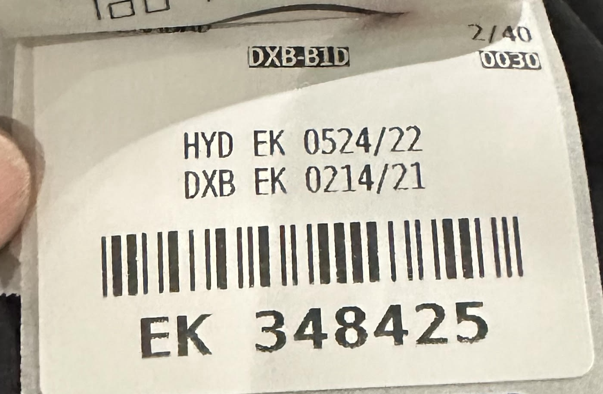

---
## History


1986
--
### Challenge
> Given a text file and an integer k, print the k most
common words in the file (and the number of
their occurrences) in decreasing frequency.
--

### Don Knuth

Produces an absolute virtuoso work of art using literate programming and WEB.
* Elegant Pascal code
* Tries
* Beautifully typeset with cross-references

--

### Doug McIlroy 

```
tr -cs A-Za-z`
` |
tr A-Z a-z |
sort |
uniq -c |
sort -rn |
sed ${1} q 

```
--
## Pipeline Style
* Writing a series of transformations as a single expression without nested parentheses, rather than the more standard style of using separate invocations. 
* Common in other languages
  * Bash uses `|` to “pipe” data through a sequence of programs. 
  * F# uses `|>`  
* The primary syntactic feature is the lack of unbounded nesting.
--
## C++ pseudocode
```c++
// Standard C++, non-pipelined
auto result1 = f1(input);
auto result2 = f2(result1);
auto result3 = f3(result2);

// Pipeline style
auto result = input | f1 | f2 | f3;

```
--
### Terminology
* Pipeline
  * The entire series
  * `input | f1 | f2 | f3`;
* Stage
  * Each individual component of the pipeline
    * f1
    * f2
    * f3
  * Also have seen *combinator* used for this, but this talk will use *stage*
--

### std::ranges
```c++
 auto const ints = {0, 1, 2, 3, 4, 5};
 auto even = [](int i) { return 0 == i % 2; };
 auto square = [](int i) { return i * i; };

 for (int i : ints 
              | std::views::filter(even) 
              | std::views::transform(square))
     std::cout << i << ' ';

```
* https://en.cppreference.com/w/cpp/ranges#Range_adaptors
--

### A more complicated example
```c++
 using IntAndString = std::pair<int, std::string>;
 auto make_int_and_string = [](int i) -> IntAndString {
     return {i*i*i, std::to_string(i)};
 };
 auto result = std::views::iota(1,1000001)                           //
   | std::views::transform(make_int_and_string)  
   | std::views::filter([](const auto& p) {
        return p.first >= std::hash<std::string>()(p.second);
    })
   | std::views::transform(&IntAndString::second)  
   | std::views::take(4);
 for (auto s : result) 
   std::cout << s << "\n";
```


--

# Crash

--
#### Why?
```c++[|6,10]
 using IntAndString = std::pair<int, std::string>;
 auto make_int_and_string = [](int i) -> IntAndString {
     return {i*i*i, std::to_string(i)};
 };
 auto result = std::views::iota(1,1000001)                           //
   | std::views::transform(make_int_and_string)  
   | std::views::filter([](const auto& p) {
        return p.first >= std::hash<std::string>()(p.second);
    })
   | std::views::transform(&IntAndString::second)  
   | std::views::take(4);
 for (auto s : result) 
   std::cout << s << "\n";
```
--
#### Reduced
```c++[]
 using IntAndString = std::pair<int, std::string>;
 auto make_int_and_string = [](int i) -> IntAndString {
     return {i*i*i, std::to_string(i)};
 };
 auto result = std::views::iota(1,1000001)                           //
   | std::views::transform(make_int_and_string)  
   | std::views::transform(&IntAndString::second)  
 for (auto s : result) 
   std::cout << s << "\n";
```


--
#### Transform Iterators

```c++[|10-11]
struct MakeIntAndStringIterator{
  IotaIterator iota_iter;
  IntAndString operator*(){
    return make_int_and_string(*iota_iter);
  }
};

struct SecondIterator{
  MakeIntAndStringIterator int_and_string_iter;
  std::string& operator*(){
    return (*int_and_string_iter).second;
  }
}


```
--
#### Transform Iterators Inlined

```c++[|5]
struct SecondIteratorInlined{
  IotaIterator iota_iter;
  std::string& operator*(){
    int i = *iota_iterator;
    return std::pair<int,string>{i*i*i,std::to_string(i)}.second;
  }
}


```

Note:
* Range V3 `views::cache1`
* This in not in std ranges

--
### TPOIASI
```c++
int times2(int n){
   return n * 2;
}
bool isMultipleOf4(int n){return n % 4 == 0;}

int main() {
 std::vector<int> numbers = {1, 2, 3, 4, 5};
 auto results = numbers 
  | std::ranges::views::transform(times2) 
  | std::ranges::views::filter(isMultipleOf4);
 for (auto result : results) 
     std::cout << result << '\n';
}

```
* https://www.fluentcpp.com/2019/02/12/the-terrible-problem-of-incrementing-a-smart-iterator/
--
#### Output
```
4
8
```
--
### TPOIASI
```c++
int times2(int n){
   std::cout << "transforming " << n << "\n";
   return n * 2;
}
bool isMultipleOf4(int n){return n % 4 == 0;}

int main() {
 std::vector<int> numbers = {1, 2, 3, 4, 5};
 auto results = numbers 
  | std::ranges::views::transform(times2) 
  | std::ranges::views::filter(isMultipleOf4);
 for (auto result : results) 
     std::cout << result << '\n';
}

```
* https://www.fluentcpp.com/2019/02/12/the-terrible-problem-of-incrementing-a-smart-iterator/
--
#### Output
```[|2-3|6-7]
transforming 1
transforming 2
transforming 2
4
transforming 3
transforming 4
transforming 4
8
transforming 5

```
--
#### Output
```[2-3,6-7]
transforming 1
transforming 2
transforming 2
4
transforming 3
transforming 4
transforming 4
8
transforming 5

```
   * The filter iterator has an embedded loop. 
--
#### Stack size
```c++
__attribute__((noinline)) void Main7() {
  auto even = [](auto i) { return i % 2 == 0; };
  std::vector<int> r0 = {0, 1, 2, 3, 4, 5, 6, 7, 8, 9, 10};
  auto result = r0 | std::views::filter(even) //
                | std::views::filter(even)    //
                | std::views::filter(even)    //
                | std::views::filter(even)    //
                | std::views::filter(even)    //
                | std::views::filter(even)    //
                | std::views::filter(even);
  PrintStack("Main7");
}

```
* https://godbolt.org/z/6zhGaf588 
--

#### Stack size
```c++

int main() {
  Main0();
  Main1();
  Main2();
  Main3();
  Main4();
  Main5();
  Main6();
  Main7();
}
```

--
#### Output
```
Main0 192 144 32 0 
Main1 192 192 32 0 
Main2 192 240 32 0 
Main3 192 320 32 0 
Main4 192 448 32 0 
Main5 192 608 32 0 
Main6 192 832 32 0 
Main7 192 1120 32 0 


```
--
#### Cubic Growth

* 144 + ((N+1)(N+2)(N+3)/6 + 2N) * 8 bytes 
* h/t Richard Smith

Note:
(Except Main0 and Main4 which is off by 8)
We get one factor of N for:

* Making each range hold the previous one by value instead of by reference 
* Creating each range object in the same full expression 
* Having each range cache its begin() so that has an amortized constant-time begin() as required by the view requirements 

--
## Rethinking
--
### `<iterator>` vs `<algorithm>`
 What if instead of a lazy pull model we did an eager push
--
#### `<iterator>`
  * Lazy
  * Flexible - we can get values even intermediate values one at a time
  * Values are pulled from the last iterator
    * Potentially multiple loops (for example filter)
  * `return` is used to supply values
    * `operator*` returns the requested value
  * `std::ranges::views` provide a way to compose iterators
--
#### `<algorithm>`
  * Eager - Finishes by end of function call
  * Top level loop that pushes values through
  * Continuation passing is used to supply values
    * The algorithms take an output iterator which is isomorphic to an invocable.
  * We need a way to compose algorithms

Note:
Continuation passing style - instead of returning a value, a function takes another function which it calls with its result
--
#### Return vs Continuation Passing Style
```c++

void Output(const std::string& s){
  std::cout << s << "\n";
}

std::string& Iterator(){
  return std::pair{1, std::string("Hello")}.second;
}

void Unsafe(){
  Output(Iterator());
}


```
--
#### Return vs Continuation Passing Style
```c++

void Output(const std::string& s){
  std::cout << s << "\n";
}


template<typename F>
void Algorithm(F f){
  f(std::pair<int, std::string>(1, "Hello").second);
}


void Safe(){
  Algorithm(&Output);
}


```

--
#### Lost Luggage is a dangling reference


Note:
* 
* So is returning in C++, because it is an opportunity to leak
* Don't return unnecessary
--
#### Landings (like returns) are an opportunity to dangle references

Note:
* Landings are disproportionately dangerous
* So is returning in C++, because it is an opportunity to dangle

--
## Rappel
* Google's alterative to std::ranges for algorithm composition
* Based on the eager push model of `<algorithm>`
* Passes each value through the series of transformations using continuation passing style.
* 

Note:
Last is not always true as we will see with incremental and complete stages.
--

### Quick Examples
We will have an example that we look at more in depth coming up. This is mainly just to get a feel of the shape.
--
#### Crash Example
```c++
 using IntAndString = std::pair<int, std::string>;
 auto make_int_and_string = [](int i) -> IntAndString {
     return {i*i*i, std::to_string(i)};
 };
 rpl::Apply(rpl::Iota(1, 10000001),
   rpl::Transform(make_int_and_string),
   rpl::Filter([](const auto& p) {
        return p.first >= std::hash<std::string>()(p.second);
    }),
    rpl::Transform(&IntAndString::second),
    rpl::Take(4),
    rpl::ForEach([](const auto& s){
        std::cout << s << "\n";
    })
 );

```
Note:
* One of the reasons we had the crash, is that we are able to directly access the reference to the temporary.
* `Apply` isolates the reference to the temporary within the context of the function.
--
#### Fume Hoods (like Apply) isolate reactive interediates (like references to temporaries)


Note:
Completing the entire pipeline in a single function call allows us to isolate references to temporaries.

--
#### TPOIASI
```c++
int times2(int n){
   std::cout << "transforming: " << n << "\n";
   return n * 2;
}
bool isMultipleOf4(int n){return n % 4 == 0;}

int main() {
 std::vector<int> numbers = {1, 2, 3, 4, 5};
 rpl::Apply(numbers 
  rpl::Transform(times2),
  rpl::Filter(isMultipleOf4),
  rpl::ForEach([](auto result){
     std::cout << result << '\n';
  }));
}

```
--
#### Output
```
transforming: 1
transforming: 2
4
transforming: 3
transforming: 4
8
transforming: 5
```
--
#### Simpler evaluation model
* Transforms and Filters are not repeatedly evaluated
* Stateful function objects for Transform
* Stateful predicates for Filter

--
#### Stack Size
```c++
__attribute__((noinline)) void RappelMain7() {
  auto even = [](auto i) { return i % 2 == 0; };

  std::vector<int> r0 = {0, 1, 2, 3, 4, 5, 6, 7, 8, 9, 10};
  [[maybe_unused]] auto result = rpl::Apply(r0,
                         rpl::Filter(even),  
                         rpl::Filter(even),  
                         rpl::Filter(even),  
                         rpl::Filter(even),  
                         rpl::Filter(even),  
                         rpl::Filter(even),  
                         rpl::Filter(even),  
                         rpl::To<std::vector>());
  PrintStack("RappelMain7");
}

```
--
#### Output
```
RappelMain0 224 112 32 192 0 
RappelMain1 224 112 32 192 0 
RappelMain2 224 128 32 192 0 
RappelMain3 224 128 32 192 0 
RappelMain4 224 128 32 192 0 
RappelMain5 224 144 32 192 0 
RappelMain6 224 160 32 192 0 
RappelMain7 224 176 32 192 0 
RappelMain14 224 320 32 192 0 
```
---

## Introducing Rappel 
### Imitation is the sincerest form of flattery 


--


--

### std::ranges implementation
--

### Helper range
```c++
template<Semiregular T>
struct maybe_view : view_interface<maybe_view<T>> {
  maybe_view() = default;
  maybe_view(T t) : data_(std::move(t)) {
  }
  T const *begin() const noexcept {
    return data_ ? &*data_ : nullptr;
  }
  T const *end() const noexcept {
    return data_ ? &*data_ + 1 : nullptr;
  }
private:
  optional<T> data_{};
};
```
--
### Helper lambdas
```c++
inline constexpr auto for_each =
  []<Range R,
     Iterator I = iterator_t<R>,
     IndirectUnaryInvocable<I> Fun>(R&& r, Fun fun)
        requires Range<indirect_result_t<Fun, I>> {
      return std::forward<R>(r)
        | view::transform(std::move(fun))
        | view::join;
  };

inline constexpr auto yield_if =
  []<Semiregular T>(bool b, T x) {
    return b ? maybe_view{std::move(x)}
             : maybe_view<T>{};
  };
```
--

### Lazy Triples
```c++
using view::iota;
auto triples =
  for_each(iota(1), [](int z) {
    return for_each(iota(1, z+1), [=](int x) {
      return for_each(iota(x, z+1), [=](int y) {
        return yield_if(x*x + y*y == z*z,
          make_tuple(x, y, z));
      });
    });
  });
```
Note:
* We have gotten away from our pipeline style a bit.
* This is actually continuation passing style

--
### Output
```c++
for(auto triple : triples | view::take(10)) {
  cout << '('
       << get<0>(triple) << ','
       << get<1>(triple) << ','
       << get<2>(triple) << ')' << '\n';
}
```
--
### Rappel
--
### Pythagorean Triples 
```c++[|2,14|3|4|5|6|7|8|9|10|11-13]
void OutputPythagoreanTriples() {
 rpl::Apply(
  rpl::Iota(1),
  rpl::ZipResult([](int c) {return rpl::Iota(1, c+1);}),
  rpl::Flatten(),
  rpl::ZipResult([](int c, int a){return rpl::Iota(a, c+1);}),
  rpl::Flatten(),
  rpl::Filter([](int c, int a, int b){return a*a + b*b == c*c;}),
  rpl::Swizzle<1, 2, 0>(),
  rpl::Take(10),
  rpl::ForEach([](int a, int b, int c){
   std::cout << a << " " << b << " " << c << "\n";
  })
 );
}
```
Note:
* Apply 
  * Input
  * One or more *stage*
  * Input + Stages = Pipeline
  * Eager execution
* Iota - Generator
* ZipResult - Calls a function object with the stream values, and zips it
* Flatten - Flattens the last stream argument - outputting the previous args and every sub-element of the last arg
* Filter - Only passes to next stage iff predicate is true
* Swizzle - Rearranges the stream arguments
* Take
* ForEach - Notice now we get multiple arguments
--
### Repetition 
```c++ [|4-5|6-7]
void OutputPythagoreanTriples() {
 rpl::Apply(
  rpl::Iota(1),
  rpl::ZipResult([](int c) {return rpl::Iota(1, c+1);}),
  rpl::Flatten(),
  rpl::ZipResult([](int c, int a) {return rpl::Iota(a, c+1);}),
  rpl::Flatten(),
  rpl::Filter([](int c, int a, int b){return a*a + b*b == c*c;}),
  rpl::Swizzle<1, 2, 0>(),
  rpl::Take(10),
  rpl::ForEach([](int a, int b, int c){
   std::cout << a << " " << b << " " << c << "\n";
  })
 );
}

```
--
### Compose 
```c++[2-3|6-7|]
void OutputPythagoreanTriples() {
 auto zip_flat = [](auto f){
  return rpl::Compose(rpl::ZipResult(f), rpl::Flatten());};
 rpl::Apply(
  rpl::Iota(1),
  zip_flat([](int c) {return rpl::Iota(1, c+1);}),
  zip_flat([](int c, int a) {return rpl::Iota(a, c+1);}),
  rpl::Filter([](int c, int a, int b){return a*a + b*b == c*c;}),
  rpl::Swizzle<1, 2, 0>(),
  rpl::Take(10),
  rpl::ForEach([](int a, int b, int c){
   std::cout << a << " " << b << " " << c << "\n";
  })
 );
}

```
--
<!-- .slide: data-transition="slide-in none-out" -->
### Flexibility 
```c++[|10-13||1]
void OutputPythagoreanTriples() {
 auto zip_flat = [](auto f){
  return rpl::Compose(rpl::ZipResult(f), rpl::Flatten());};
 rpl::Apply(
  rpl::Iota(1),
  zip_flat([](int c) {return rpl::Iota(1, c+1);}),
  zip_flat([](int c, int a) {return rpl::Iota(a, c+1);}),
  rpl::Filter([](int c, int a, int b){return a*a + b*b == c*c;}),
  rpl::Swizzle<1, 2, 0>(),
  rpl::Take(10),
  rpl::ForEach([](int a, int b, int c){
      std::cout << a << " " << b << " " << c << "\n";
  })
 );
}

```
--
<!-- .slide: data-transition="none-out none-in" -->
### Flexibility 
```c++[1||4]
auto PythagoreanTriples() {
 auto zip_flat = [](auto f){
  return rpl::Compose(rpl::ZipResult(f), rpl::Flatten());};
 rpl::Apply(
  rpl::Iota(1),
  zip_flat([](int c) {return rpl::Iota(1, c+1);}),
  zip_flat([](int c, int a) {return rpl::Iota(a, c+1);}),
  rpl::Filter([](int c, int a, int b){return a*a + b*b == c*c;}),
  rpl::Swizzle<1, 2, 0>(),
  rpl::Take(10),
  rpl::ForEach([](int a, int b, int c){
      std::cout << a << " " << b << " " << c << "\n";
  })
 );
}

```
--
<!-- .slide: data-transition="none-out none-in" -->
### Flexibility 
```c++[4||10-13]
auto PythagoreanTriples() {
 auto zip_flat = [](auto f){
  return rpl::Compose(rpl::ZipResult(f), rpl::Flatten());};
 return rpl::Compose(
  rpl::Iota(1),
  zip_flat([](int c) {return rpl::Iota(1, c+1);}),
  zip_flat([](int c, int a) {return rpl::Iota(a, c+1);}),
  rpl::Filter([](int c, int a, int b){return a*a + b*b == c*c;}),
  rpl::Swizzle<1, 2, 0>(),
  rpl::Take(10),
  rpl::ForEach([](int a, int b, int c){
      std::cout << a << " " << b << " " << c << "\n";
  })
 );
}

```
--
<!-- .slide: data-transition=" none-in" -->
### Flexibility 
```c++[]
auto PythagoreanTriples() {
 auto zip_flat = [](auto f){
  return rpl::Compose(rpl::ZipResult(f), rpl::Flatten());};
 return rpl::Compose(
  rpl::Iota(1),
  zip_flat([](int c) {return rpl::Iota(1, c+1);}),
  zip_flat([](int c, int a) {return rpl::Iota(a, c+1);}),
  rpl::Filter([](int c, int a, int b){return a*a + b*b == c*c;}),
  rpl::Swizzle<1, 2, 0>()


 );
}

```
--
### Pythagorean Triples 
```c++[|6|7|8|9|10]
auto PythagoreanTriples() {
 auto zip_flat = [](auto f){
  return rpl::Compose(rpl::ZipResult(f), rpl::Flatten());};

 return rpl::Compose(
  rpl::Iota(1),
  zip_flat([](int c) {return rpl::Iota(1, c+1);}),
  zip_flat([](int c, int a) {return rpl::Iota(a, c+1);}),
  rpl::Filter([](int c, int a, int b){return a*a + b*b == c*c;}),
  rpl::Swizzle<1, 2, 0>()
 );
}

```
Note:
* Hypotenuse length
* Long leg length
* Short leg length
--
### Pythagorean Triples 
```c++[|2,7|3|4|5|6]
vector<tuple<int,int,int>> triples = 
  rpl::Apply(
    PythagoreanTriples(),
    rpl::Take(100),
    rpl::MakeTuple(), 
    rpl::To<std::vector>()
  );

```


 