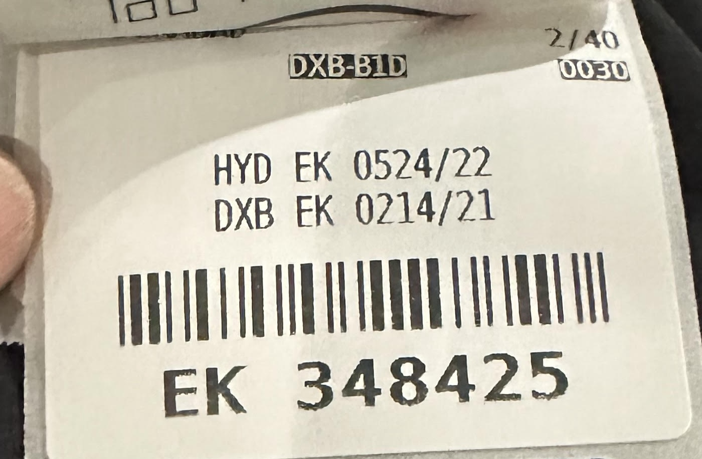

---
## Challenge
> Given a text file and an integer k, print the k most
common words in the file (and the number of
their occurrences) in decreasing frequency.
---
## Stages
---
### ReadLines
```c++
auto ReadLines() {
  return rpl::TransformComplete([](std::istream &is) {
    return rpl::Generator<absl::string_view>(
        [&is, line = std::string()](auto output) mutable {
          if (std::getline(is, line)) {
            std::move(output)(line);
          }
        });
  });
}
```

---
### Split String
```c
auto SplitString() {
 return rpl::Compose(
   rpl::Transform(
    [](absl::string_view s) {
      return absl::StrSplit(
        s,
        absl::ByAsciiWhitespace(),
        absl::SkipEmpty()
      );
   }),
   rpl::Flatten()
  );
}
```
---
### Lower Case String
```c++
auto LowerCaseString() {
  return rpl::Transform([](absl::string_view s) {
    return rpl::Apply(  
        s,              
        rpl::Transform([](char c) { return std::tolower(c); }),
        rpl::To<std::string>()  
    );
  });
}
```
---
### Unique Counts
```c++
auto UniqueCounts() {
 return rpl::Compose(
  rpl::MapGroupBy<absl::flat_hash_map>(
    std::identity(), rpl::Count()),
  rpl::Swizzle<1, 0>(),
  rpl::MakePair()
 );
}

```

---

## Word Counts Pipeline 

```c++
rpl::Apply(
 std::ref(std::cin),   
 ReadLines(),    
 SplitString(),  
 LowerCaseString(),  
 UniqueCounts(),  
 rpl::To<std::vector>(),       
 rpl::PartialSort(k, std::greater<>()),  
 rpl::Take(k),
 rpl::ExpandTuple(),
 rpl::ForEach([](int n, const auto &s) {
   std::cout << n << " " << s;
 })
);


```
---

Note:
We minimize our landings (return)
---

Note:
 Reducing our risk of dangling references
---

Note:
And we safely isolate temporary references inside Apply
---
# Questions
